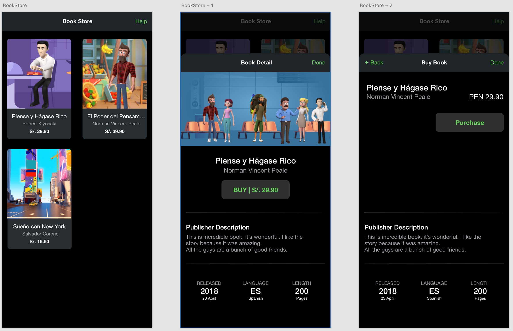

# Custom Modal Navigation using Page Router Outlet NS-Angular + NS8 RootLayout

## Book Store App Flow  

  

## iOS Book Store App Flow

  

## Android Book Store App Flow

  

## Would you like to navigate between components in a custom modal?  

Donwload this repo!
